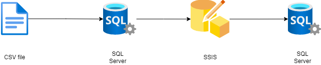
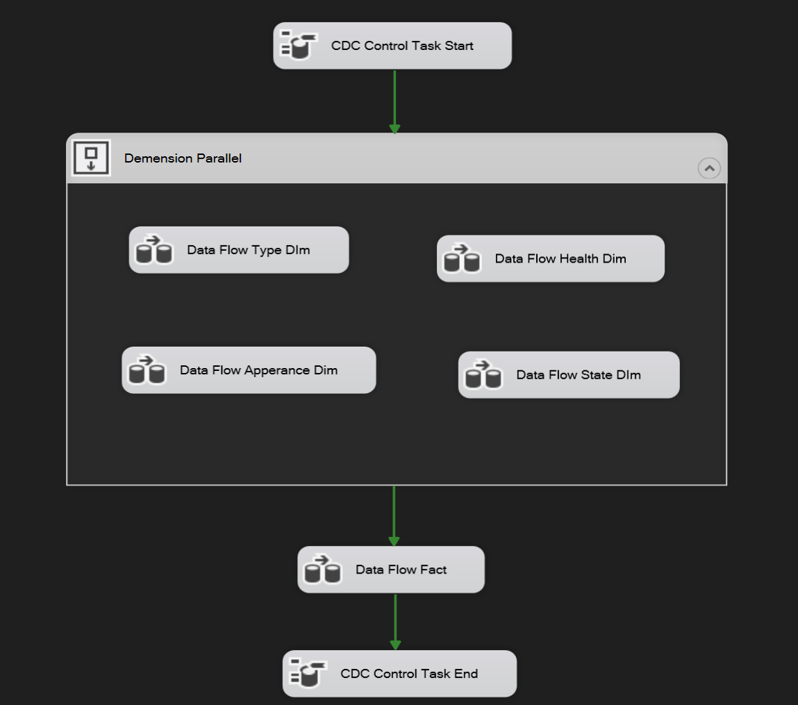
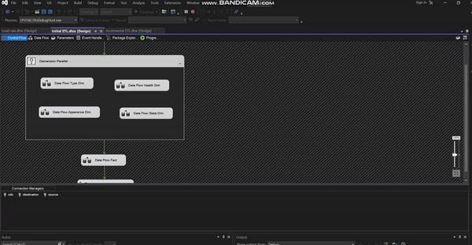

# ETL with SSIS

### 1. Model

### 2. Raw file
- [CSV file](PetFinder.csv) includes PetID,	Type, Age, Breed1, Breed2, Gender, Color1, Color2, Color3, MaturitySize, FurLength, Vaccinated, Dewormed, Sterilized, Health, Quantity, Fee, State, RescuerID

### 3. Transforming
- SSIS collects flat data from SQL Server and turns it into a [Star Schema](data-warehouse-model.sql)
- DIM tables are transformed at the same time.

